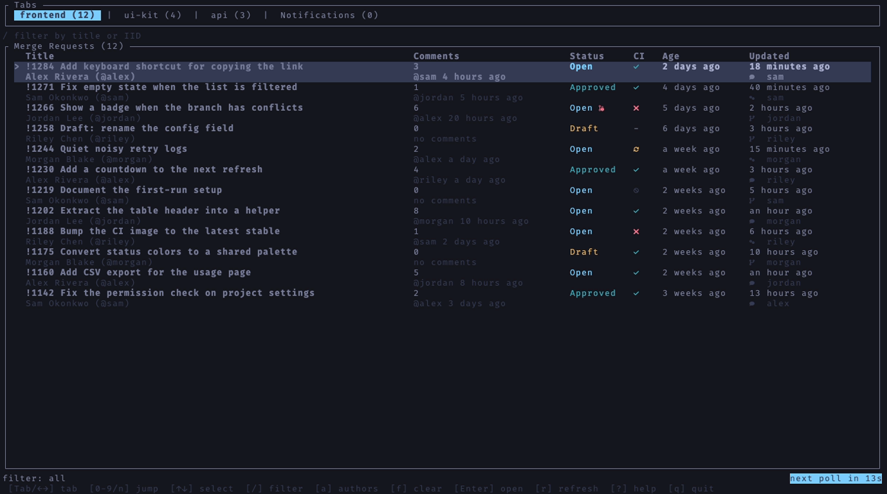

# glab-feed

A live-updating terminal UI for GitLab merge requests, built with [ratatui](https://ratatui.rs). It polls your configured repos every 15 seconds using the [`glab`](https://gitlab.com/gitlab-org/cli) CLI under the hood.



## Features

- Repo tabs across the top, one per configured project, plus a Notifications tab
- Table of open MRs with title + author, comment count + last commenter, status (draft/open/approved), CI result, and age
- **Notifications feed** — persistent list of MR comments, replies to your review comments, reviews, review requests, and failed pipelines
- **cmux notifications** — when running inside [cmux](https://cmux.com), alerts via `cmux notify` for new notification-tab activity and when your MRs get approved
- Live countdown to the next poll, default sort by most recently updated
- First-run setup: enter your GitLab host, then pick repos from a filterable tree
- Interactive repo selector, saved back to `config.toml`

## Requirements

- Rust (edition 2021)
- [`glab`](https://gitlab.com/gitlab-org/cli) installed and authenticated (`glab auth login`, or a `GITLAB_TOKEN` env var)

## Install

```bash
cargo build --release
./target/release/glab-feed
```

## Configuration

On first run (no config present) the app prompts for your GitLab remote URL and opens the repo selector. Selections are written to:

- macOS: `~/Library/Application Support/glab-feed/config.toml`
- Linux: `~/.config/glab-feed/config.toml`

```toml
host = "git.example.com"

[[repos]]
name = "my-repo"          # optional tab label; defaults to path
path = "group/my-repo"
```

## Keybindings

| Key | Action |
| --- | --- |
| `Tab` / `←` `→` | Switch tab (repos or Notifications) |
| `0` / `1` | Jump to first repo |
| `2`–`8` | Jump to repo 2–8 |
| `9` | Jump to last repo |
| `n` | Jump to Notifications tab |
| `↑` `↓` / `j` `k` | Move selection |
| `m` | Toggle showing only my own MRs (repo tabs) |
| `Enter` | Open selected MR or notification in browser |
| `Opt-Enter` | Open selected MR in cmux split (when `cmux` is installed) |
| `c` | Copy MR/notification URL to clipboard |
| `C` | Copy MR reference (e.g. `!2191`) to clipboard |
| `Ctrl-Shift-C` | Copy menu: MR URL, MR ID, link (`!ref`), or branch |
| `s` | Open the repo selector |
| `r` | Refresh now |
| `q` / `Esc` | Quit |

Notifications are stored in the same config directory as `config.toml` (`notifications.json`), capped at 300 items.

### Repo selector

| Key | Action |
| --- | --- |
| `↑` `↓` / `j` `k` | Move cursor |
| `Space` | Toggle project selection |
| `Tab` | Cycle filter: All / Mine / Member |
| `Enter` | Save to `config.toml` and reload |
| `Esc` / `q` | Cancel |
